# Sphere (iOS)

> **Your whole life, understood by agents that remember.** Twelve life-sphere
> AI agents, cross-sphere intelligence, and on-device memory — private by
> default, free without a key.


Native SwiftUI rewrite of [Sphere](https://github.com/TAIPANBOX/sphere) — a
Personal Life Intelligence System.

<p align="center">
  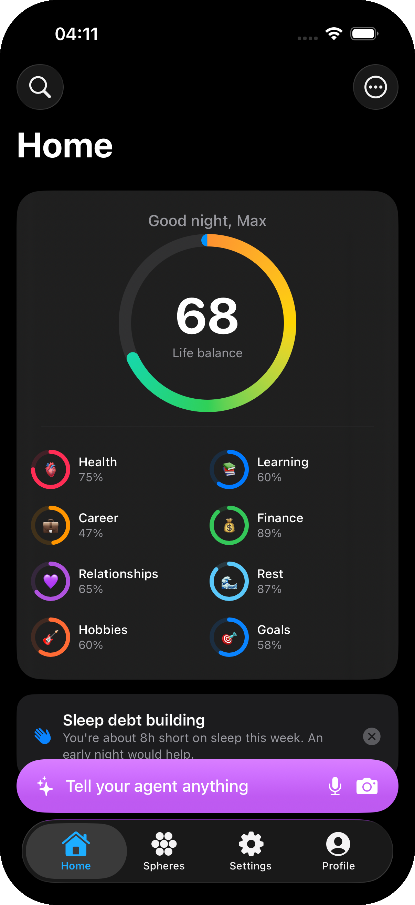
  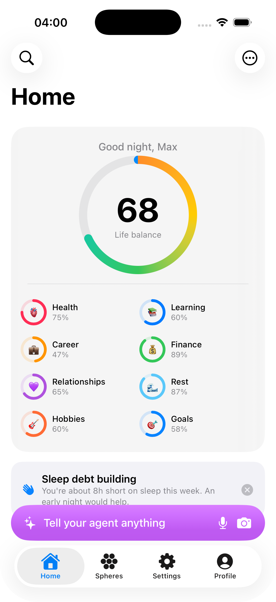
  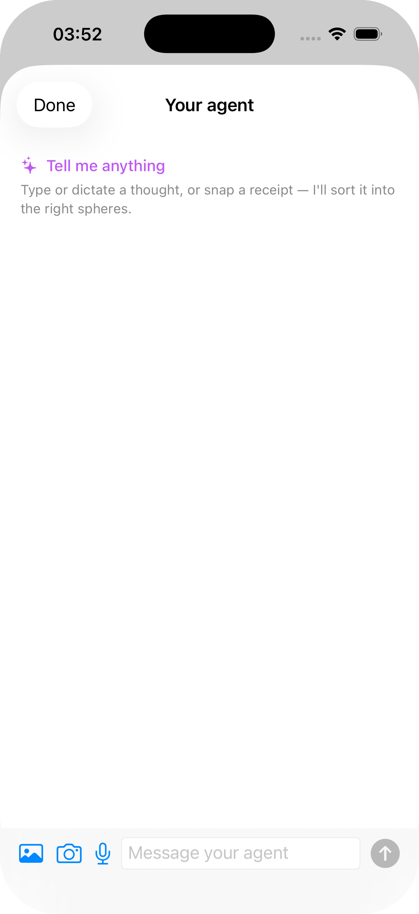
</p>

---

## The problem

Your life is scattered across a dozen apps. A habit tracker here, a budget app
there, a notes app, a calendar, a health app, a reading list. None of them talk
to each other, so none of them can tell you the thing that actually matters:
*your sleep debt is why your spending crept up this week*, or *the weeks you
meditate are the weeks you hit your goals.*

And most of them punish you. Miss a day and the streak resets to zero. Open the
app and a cold **"38% complete"** stares back. That's why the average tracker is
abandoned inside two weeks.

**Sphere is one place that sees the whole picture — and is kind about it.**

---

## What Sphere does

Twelve life spheres — Health, Finance, Career, Learning, Relationships, Rest,
Hobbies, Travel, Mindfulness, Creativity, Home, Goals — each with its own
`@Observable` store, agent tools, and screen. On top of them sits a layer that
no single-sphere app can build:

- **Life Score** — one number that rolls up all twelve spheres, with which
  ones are pulling it up or down today.
- **Today's Focus** — the handful of things that actually need your attention,
  pulled from every sphere into one list.
- **Cross-sphere correlation engine** — day-keyed metrics across every sphere,
  surfacing honest patterns ("on days your sleep is higher, your mood tends to
  be higher — a pattern, not proof").
- **Weekly narrative review + Life Wheel** — a warm recap and a feeling-vs-data
  gap chart across the twelve spheres.
- **N-of-1 experiments** — "cut caffeine after 2pm for two weeks," measured
  against the baseline across sleep, mood, and spend. Passive logging becomes
  personal science.
- **Year in Sphere** — a free, shareable recap of your year across every
  sphere.
- **Forgiveness + momentum** — excused days bridge streaks; warm "building
  momentum" framing replaces the cold percentage.

Everything works with **zero setup and no account**. Rule-based quick capture
("water 2, mood 4, spent 12 on lunch") and every deterministic feature run with
no model at all.

<p align="center">
  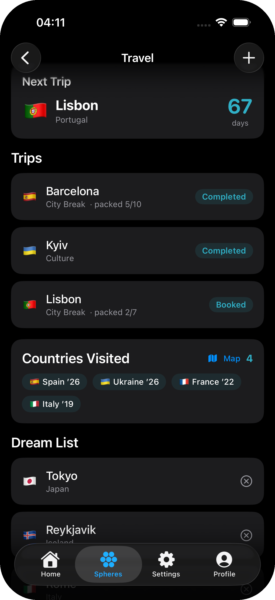
  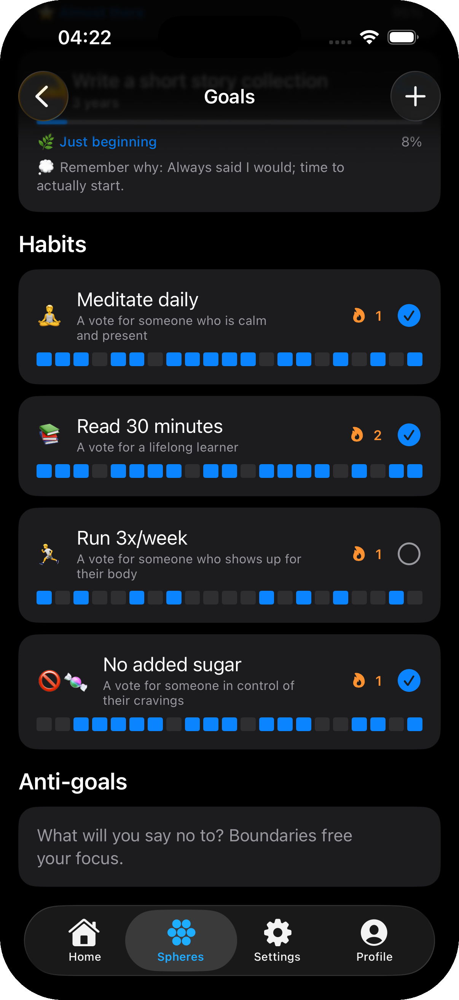
  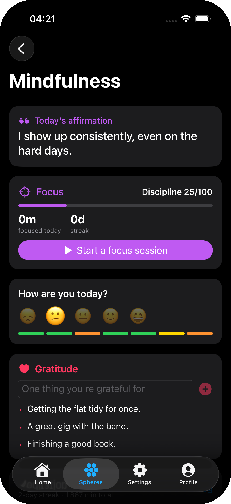
  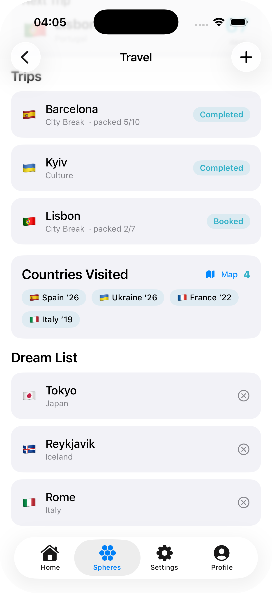
  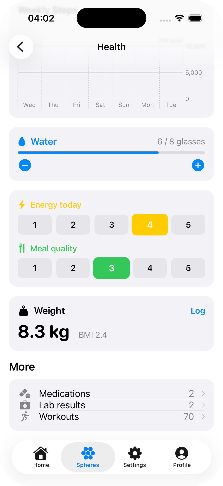
  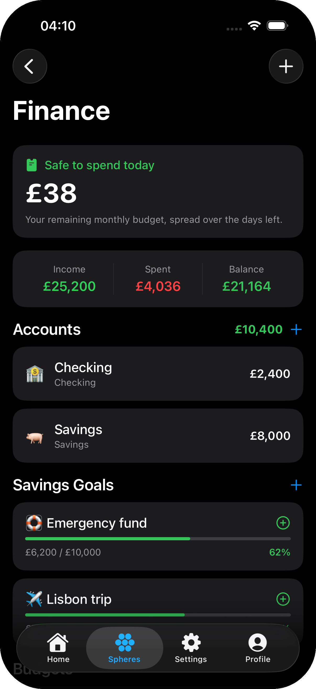
</p>

---

## Talk to it

**Universal capture.** One button, everywhere: type it, dictate it, or snap a
photo of a receipt. Sphere reads it, sorts it into the right sphere, and asks
only when it has to.

**Continuation suggestions.** After you log something, Sphere offers the next
sensible step instead of waiting for you to remember it — log the workout,
then it offers to log the protein shake.

**Per-sphere agents with memory.** Each sphere has its own agent and its own
tools (`log_water`, `add_expense`, `log_mood`, …). Engram, the on-device memory
layer, gives every agent episodic recall — it remembers what you told it last
month, not just this session.

**Morning brief.** A short, factual rundown assembled from calendar, sleep,
and budget pace, delivered as a notification before you've opened the app.

<p align="center">
  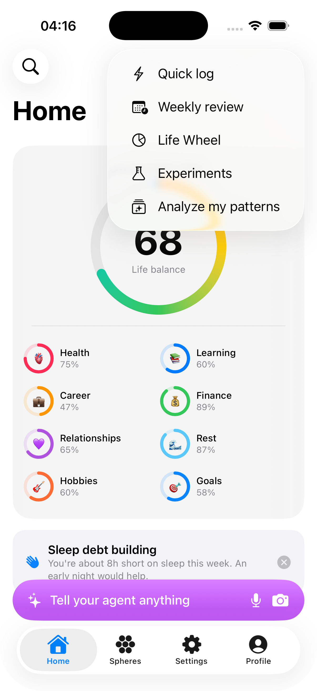
</p>

---

## AI, three ways — free first

| Tier | Backend | Cost | Needs |
|------|---------|------|-------|
| Free | Apple Foundation Models (on-device) | Free | iPhone 15 Pro+ / iOS 26 |
| Free | Downloaded model (MLX, on-device) | Free | A recent device + a download |
| Power | OpenRouter (Claude · GPT · Gemini · …) | Your key | One OpenRouter key (optional) |

Nothing ever *requires* a key. The on-device paths keep your data on your
phone. Pick a hosted model any time from a live, searchable picker — pricing
and context length shown per model — and switch back to on-device whenever you
want.

<p align="center">
  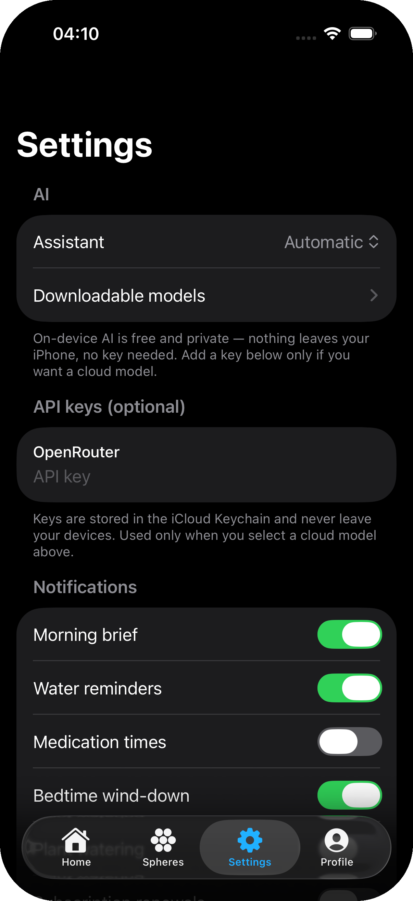
  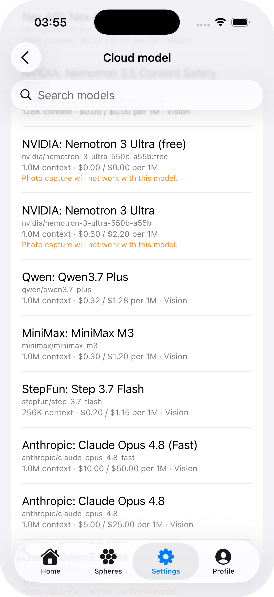
</p>

**Privacy angle:** local-first by design, no accounts, no server. Your data
lives in on-device storage; your API key (if you add one) stays in the iCloud
Keychain and is used only when you pick a cloud model.

---

## Apple Watch

- **Quick logs with live state** — water, mood, and today's focus items, right
  on the wrist, reflecting what's already logged on the phone.
- **Voice capture** — dictate a thought or a shopping item without unlocking
  your phone.
- **Interactive Smart Stack widget** and complication showing the Life Score.
- **Action Button** wired to quick capture.
- **Actionable notifications** — respond to a nudge without opening the app.

<p align="center">
  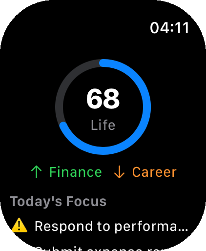
  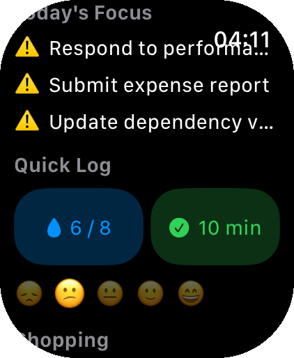
  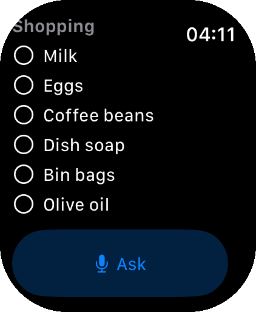
</p>

---

## Native integrations

- **HealthKit, two-way** — steps, heart rate, sleep, cycle, workouts, and
  weight flow in; Sphere writes back what you log.
- **Import from device** — Contacts and birthdays into Relationships,
  Calendar events into your morning brief, Reminders into Career tasks. Runs
  on-device, idempotent — run it again any time, nothing duplicates.
- **Interactive iOS widgets** and a Smart Stack widget on watchOS.
- **Siri shortcuts** for quick capture and sphere summaries.
- **Face ID lock** and full JSON data export in Settings.
- **Notifications engine** for the morning brief, water/medication reminders,
  and bedtime wind-down.

<p align="center">
  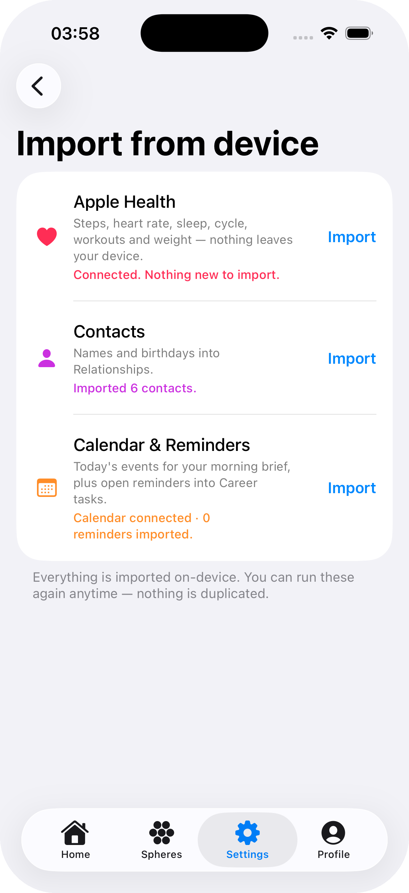
</p>

---

## Gallery

<p align="center">
  
  
  
  
  
  
  
  
  
  
  
  
  
  
  
  
  
</p>

---

## Architecture

```
SphereCore/            SPM package — pure Swift, no UIKit. `swift test`-able,
                       shared by every target.
├── Sources/SphereCore Models, 12 sphere stores (GRDB), Engram memory, LLM
│                      engines, agent service, insight/nudge/review/experiment
│                      engines, search, on-device model manager.
└── Sources/SphereUI   All SwiftUI screens (compiles on macOS too, for previews).

Sphere/                iOS app target (XcodeGen — project.yml).
SphereWidget/          Home-screen + Smart Stack widget.
Watch/                 watchOS app + complication + WCSession bridge.
```

- **Language:** Swift 6, strict concurrency, `@Observable` stores — one per
  sphere, no architecture frameworks.
- **Persistence:** [GRDB](https://github.com/groue/GRDB.swift) with additive
  migrations; one App Group container shared with the widget, App Intents, and
  watch.
- **Memory:** Engram v1.5 — episodic memory with FTS5/BM25 recall, access
  reinforcement, and Ebbinghaus decay.
- **LLM:** one OpenAI-compatible cloud engine (OpenRouter) behind a single
  `LLMEngine` seam, plus Apple Foundation Models and MLX-backed local models.
- **Sync:** CloudKit; wearables via HealthKit — no per-service OAuth.
- **Tests:** 583 tests (swift-testing), CI-gated, no singletons in
  `SphereCore` — everything is injected.

## Build

```bash
# Core package — pure Swift, runs anywhere Swift does
cd SphereCore
swift build
swift test          # 583 tests

# App — generate the Xcode project, then build for a simulator
brew install xcodegen
xcodegen generate
xcodebuild -project Sphere.xcodeproj -scheme Sphere \
  -destination 'platform=iOS Simulator,name=iPhone 17 Pro' build
```

The downloaded-model backend uses MLX, which needs a device GPU: the code
compiles for the simulator but runs inference only on a real device.

## Privacy

Local-first by design. Sphere data lives in on-device GRDB; the free AI paths
never leave the phone. API keys (optional) are stored in the iCloud Keychain and
used only when you pick a cloud model. Full data export (JSON) and a Face ID lock
ship in Settings.

## Status

All twelve spheres plus the intelligence, platform-integration, and polish
stages are built — see [docs/ROADMAP.md](docs/ROADMAP.md) for the full,
dependency-ordered plan and what remains (constrained on-device tool calling,
Spotlight donation, notification delivery of nudges).

## Contributing

See [CONTRIBUTING.md](CONTRIBUTING.md). In short: `swift test` must stay green,
every public `SphereCore` API gets a test, and all repo content is in English.

## License

[MIT](LICENSE) © TAIPANBOX
